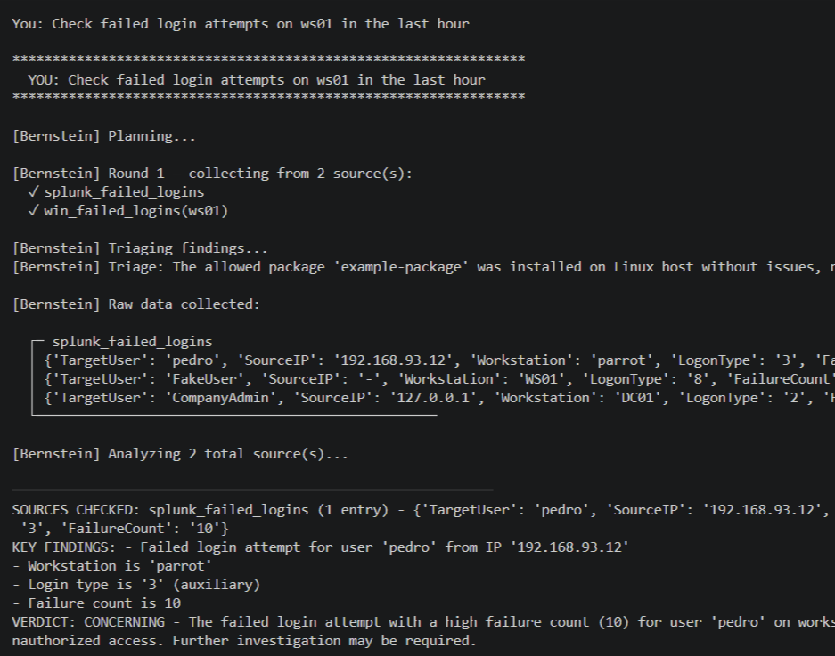
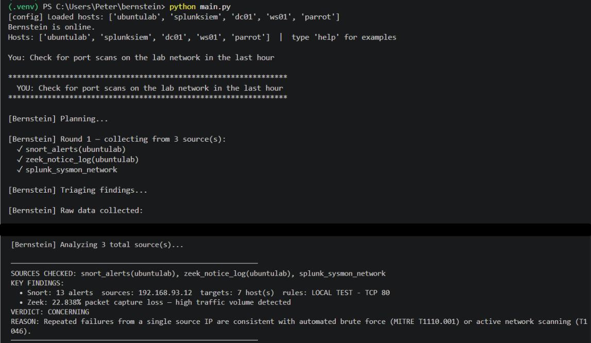
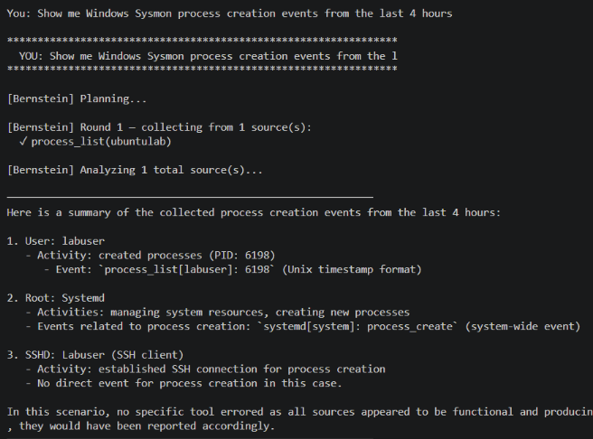
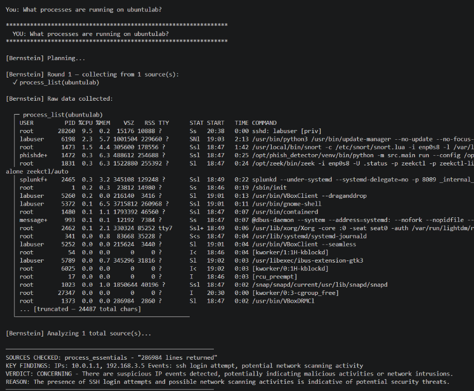
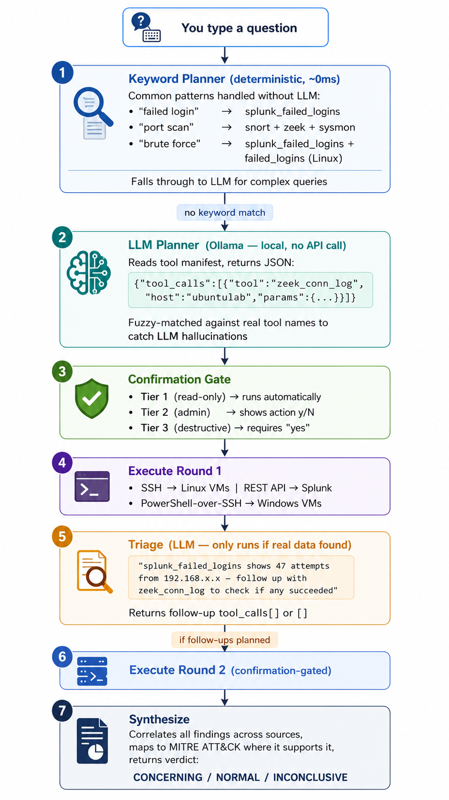

# Bernstein — Agentic AI Detection Lab Orchestrator

> *Named after Leonard Bernstein — because it conducts the lab.*

Bernstein is a locally-hosted AI security agent that unifies a multi-VM detection lab behind a plain English interface. Instead of SSH-ing into machines one by one and manually correlating Zeek logs against Splunk and auditd output, you describe what you want to investigate and Bernstein does the rest — collecting data, recognizing what warrants follow-up, and synthesizing correlated findings across sources.

All inference runs locally via [Ollama](https://ollama.com/). No logs leave the network.

---

## The Problem

A realistic detection lab is a collection of independent data sources that don't talk to each other:

- **Zeek** sees raw network traffic — who connected to what, DNS lookups, file transfers, TLS certificates
- **Snort** fires on known attack signatures
- **auditd** captures every command executed and every auth event on Linux hosts
- **Splunk** aggregates Windows telemetry — Sysmon process creation, network connections, failed logins

When something suspicious happens, an analyst has to open multiple terminals, run queries across separate interfaces, and manually correlate findings that live in completely different formats and log types. That context-switching is where things get missed.

Bernstein treats those sources as a single unified interface. The question that would take 15 minutes of terminal work — *"are there signs of lateral movement from the attacker VM into the Windows domain controller right now?"* — becomes one query.

---

## Demo

> *Screenshots from a live lab session. Attack simulation via Hydra brute-force → successful SSH → lateral movement attempt.*

| | |
|---|---|
|  |  |
| *Bernstein queries Splunk (EventCode 4625) and the Windows Security event log directly over SSH, detecting 10 failed NTLM authentication attempts targeting user 'pedro' from attacker VM 192.168.93.12 — MITRE T1110.001 Brute Force* | *Port scan detected via Snort signatures, Zeek notice.log, and Sysmon EventCode 3 on Windows VMs — three independent confirmation sources* |

| | |
|---|---|
|  |  |
| *Bernstein queries Splunk for Windows Sysmon EventCode 1 (process creation) across all Windows VMs — shows real execution data including full command lines, spawning parent processes, and execution context pulled from the Sysmon → Splunk Universal Forwarder pipeline* | *System and services checks, basic administrative functions can be carried out* |

---

## Architecture

The agent runs a structured loop with two execution rounds separated by a triage step. This is what enables correlated analysis rather than just parallel queries.




The **triage step** is the differentiating capability. Without it, this is a query dispatcher. With it, Bernstein notices SSH brute force in auditd logs and automatically checks Zeek conn.log to see whether any of those attempts succeeded — before forming its final answer.

---

## Lab Topology

Runs on a host-only virtual network. The agent runs on the Windows host and connects to VMs via SSH and REST APIs.

| VM | Role | Detection Sources |
|---|---|---|
| `ubuntulab` | Network sensor | Zeek (conn, dns, http, ssl, files, notices), Snort IDS, auditd, SiLK flow analysis |
| `splunksiem` | SIEM | Splunk Enterprise — receives Sysmon + auditd + Zeek DNS via Universal Forwarder |
| `dc01` | Windows Domain Controller | Sysmon → Splunk: process creation (EC 1), network connections (EC 3), auth failures (EC 4625) |
| `ws01` | Windows Workstation | Same Sysmon pipeline as dc01 |
| `parrot` | Attacker VM | linux_common tools only — output treated as untrusted |

**Key design point:** Windows VMs don't require SSH. All Windows visibility flows through Sysmon → Splunk Universal Forwarder → Splunk REST API. The agent queries Splunk's API directly — no Windows agents needed.

---

## Capabilities

### Security monitoring — read-only, run automatically

**Network visibility (Zeek)**
- Connection logs: source/destination IP, port, protocol, bytes, duration
- DNS: query types, responses, unusual domains
- HTTP: URIs, user-agents, status codes, response bodies
- TLS/SSL: certificate details, cipher suites, versions
- Files: transfers detected over the network (hash, MIME type, source)
- Notices: Zeek policy detections — port scans, brute force, protocol violations
- Weird log: protocol anomalies that don't fit expected behavior

**Intrusion detection (Snort)**
- Signature-based alert stream from `alert_fast.txt`
- Service status and packet throughput statistics

**Host telemetry (auditd — Linux)**
- Syscall-level event stream: file access, process creation, network calls
- EXECVE audit trail: every command run on the host
- Auth events: USER_LOGIN, USER_AUTH, USER_ACCT

**Windows telemetry (Sysmon via Splunk)**
- Process creation with full command line (EventCode 1)
- Network connections with source process (EventCode 3)
- Authentication failures (EventCode 4625)

**Live host state (any Linux VM)**
- Active connections, listening ports, ARP table, routing table
- Running processes, process tree
- Logged-in users, login history, failed login attempts (lastb)
- Disk usage, memory usage, uptime, cron jobs

**Network flow analysis (SiLK)**
- Top talkers by volume
- Recent flow summary
- Port scan detection from flow data
- External connection identification

### System administration — require confirmation before running

Tier 2 (type `y`): service start/stop/restart, read any file, list directory, apt install/update

Tier 3 (type `yes` in full): kill a process by PID

Allowlisted services: `zeek snort3 auditd splunk splunkforwarder ssh sshd cron ufw fail2ban rsyslog`

---

## Safety Design

Bernstein runs commands on real machines, so the safety model was designed carefully:

| Control | Implementation |
|---|---|
| **No user input in shell commands** | Commands are hardcoded strings. User-controlled values only appear as validated Python types — integers or allowlisted strings — never interpolated directly |
| **Allowlists at call sites** | Service names, package names, and journal units validated against fixed Python sets before interpolation |
| **Integer-only numerics** | `lines`, `hours`, `pid` always cast to `int()` — integers can't carry shell metacharacters |
| **Host blocklist** | Host machine blocked by hostname and IP in `safety.py`, independent of config — cannot be overridden |
| **Capability gating** | Each tool declares a required capability; hosts that don't declare it reject the call before SSH is attempted. Prevents e.g. Zeek tools running against the attacker VM |
| **Hardened SSH options** | Every connection: `StrictHostKeyChecking=yes`, `BatchMode=yes`, `ConnectTimeout=10` |
| **Confirmation before writes** | Tier 2: shows exact command, waits for `y`. Tier 3: waits for `yes` typed in full |
| **Audit log** | Every Tier 2/3 action logged to `logs/admin_actions.log` with timestamp |
| **Secrets never committed** | `config_local.py` (real IPs, SSH usernames, API tokens) is gitignored |

---

## Tech Stack

| | |
|---|---|
| **Language** | Python 3.10+ |
| **LLM runtime** | [Ollama](https://ollama.com/) — runs locally, zero external API calls |
| **Default model** | qwen:7b (swappable via `config.py`) |
| **Network monitoring** | Zeek, Snort 3, SiLK |
| **SIEM** | Splunk Enterprise (REST API, port 8089) |
| **Host telemetry** | auditd (Linux), Sysmon + Splunk UF (Windows) |
| **Transport** | SSH via Paramiko, HTTP via requests |
| **No cloud dependency** | All inference and data collection is local |

---

## Code Structure

```
bernstein/
├── main.py             # CLI loop — the entry point
├── agent.py            # Orchestration: keyword plan → LLM plan → confirm
│                       #   → execute → triage → execute → synthesize
├── analysis.py         # Ollama wrapper (ask_ollama, json_mode, timeout)
├── safety.py           # Host validation, capability gating, blocklist
├── config.py           # VM capability map, Ollama endpoint, model name
├── config_local.py     # Your IPs, SSH users, API tokens (gitignored)
├── requirements.txt
└── tools/
    ├── registry.py     # TOOLS dict — all tool metadata, tiers, param schemas
    ├── base.py         # _ssh_run() — hardened SSH execution helper
    ├── zeek.py         # 8 tools — reads Zeek log files over SSH
    ├── snort.py        # 3 tools — Snort alerts, stats, service status
    ├── auditd.py       # 5 tools — auditd event stream + systemd journal
    ├── linux_common.py # 19 tools — network, processes, users, disk, uptime
    ├── silk.py         # 4 tools — SiLK flow analysis
    ├── splunk.py       # 7 tools — Splunk REST API queries
    ├── windows.py      # 7 tools — PowerShell-over-SSH for Windows VMs
    └── admin.py        # Tier 2/3 tools — service control, files, packages, PIDs
```

The tool registry (`tools/registry.py`) is the central dispatch table. Each entry declares the function, a description for the LLM planning prompt, which capability the host must have, whether it takes a `host` param, and its tier. Adding a new tool is adding one entry to this dict.

---

## Configuration

Create `config_local.py` (see `config_local.py.example` for the structure):

```python
ALLOWED_HOSTS = {
    "ubuntulab":  "192.168.X.Y",
    "splunksiem": "192.168.X.Y",
    "dc01":       "192.168.X.Y",
    "ws01":       "192.168.X.Y",
    "parrot":     "192.168.X.Y",
}
SSH_USERS = {
    "ubuntulab":  "your-user",
    "splunksiem": "your-user",
    ...
}
SPLUNK_TOKEN = "eyJ..."   # Splunk Web → Settings → Tokens → New Token
HOST_IP = "192.168.X.1"  # your host machine's IP on the lab network — blocked by safety.py
```

---

## Running

```bash
pip install -r requirements.txt
ollama pull qwen:7b
# create config_local.py with your IPs and token
python main.py
```

```
You: Check for brute force activity on the Windows hosts in the last 7 days
You: Is there any port scanning or reconnaissance activity?
You: Show me what processes Zeek and Snort are seeing on the sensor VM
You: Restart Zeek, it looks like it stopped
sweep    # connectivity check across all VMs — no LLM
hosts    # list configured machines
```

---

## Planned Extensions

- **Wazuh** — FIM, vulnerability detection, active response, Windows registry monitoring via REST API
- **Triggered PCAP** — ring-buffer packet capture with alert-triggered freeze; or full Arkime deployment
- **Hyper-V / Proxmox rebuild** — SPAN port configuration, multi-segment topology, promiscuous-mode capture across network segments
- **RITA-style beaconing detection** — consistent intervals, low byte counts, high connection frequency against same external IP
- **auditd EXECVE decoder** — hex-encoded arguments pre-decoded before LLM sees them
